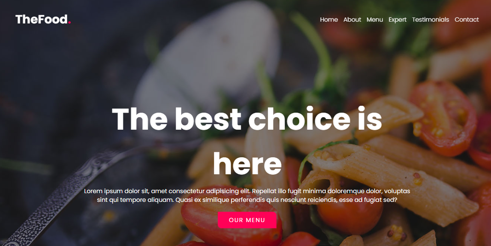
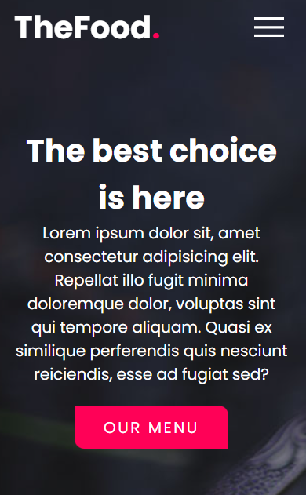

 

# The Food Page

Page made following some steps of a video on yt. And editing it in my style.

> Challenge

### Made with 🔨

<a href="https://devdocs.io/html/" target="_blank">

<a/>

<a href="https://devdocs.io/css/" target="_blank">

<a/>

<a href="https://devdocs.io/javascript/" target="_blank">

<a/>
 

### Project view

<a href="https://pixe-l.github.io/page-food/">Take a look at the page.</a>

